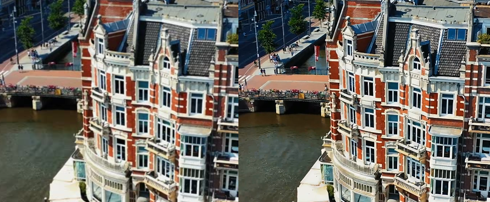

# Video Super Resolution with Pytorch
Video Super Resolution is the process of generating high-res videos from the given low-res ones. The main goal is to restore more fine details.

## Introduction

[Architecture]: Frame-Recurrent Video Super-Resolution, Sajjadi et al. (https://arxiv.org/pdf/1512.02134.pdf)
[Dataset]: It was obtained from 30 video taken from Youtube by me.


Implementation of FRVSR arhitecture with some tweaks such as:

* adding new PP Loss (references (https://arxiv.org/pdf/1811.09393.pdf))
* modifing arhitecture residual blocks by adding new spectral normalization layers (references (https://arxiv.org/pdf/1802.05957.pdf))
* adding depth to the model ( more channels and res blocks )

[Paper](https://lmb.informatik.uni-freiburg.de/Publications/2016/MIFDB16/paper-MIFDB16.pdf)


## Requirements

* numpy, 1.19.2
* pytorch + torchvision, 1.8.0 and 0.9.0
* cv2, 4.0.1
* ffmpeg, 4.3.1
* tk, 8.6.10

## Run

Starting the GUI:
```
python interface.py
```
#[interface](preview/interface.png)

## Results

Crop from an Input video (left) size 640x360 and coresponding output video (right) 2560x1440.



